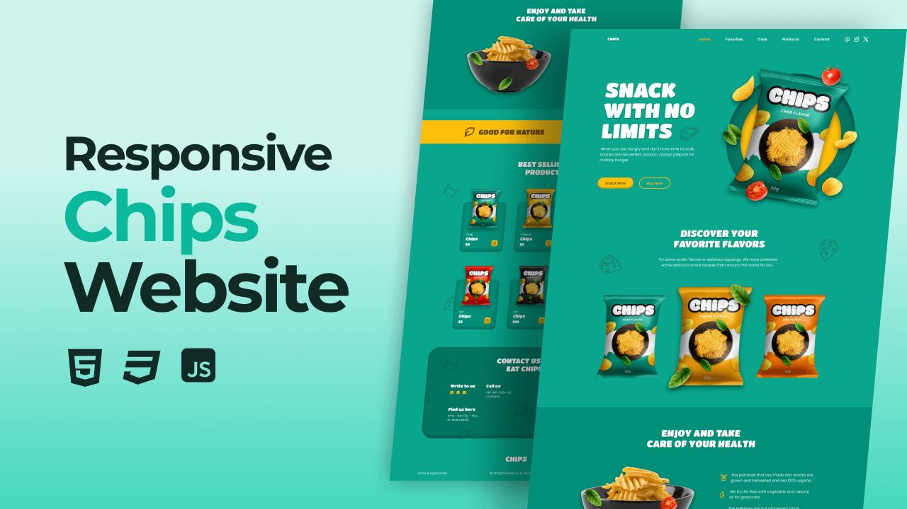

# Chips website template

Responsive Chips Website Design Using HTML CSS JavaScript and React.

## Features

- Responsive Chips Website Design Using HTML CSS JavaScript and react
- Contains animations when scrolling.
- Smooth scrolling in each section.
- Developed by mobile-first methodology, then for desktop.
- Compatible with all mobile devices with a beautiful and pleasant user interface.

## Tools

- Vitejs
- React and Typescript
- RemixIcon

## Screenshot

